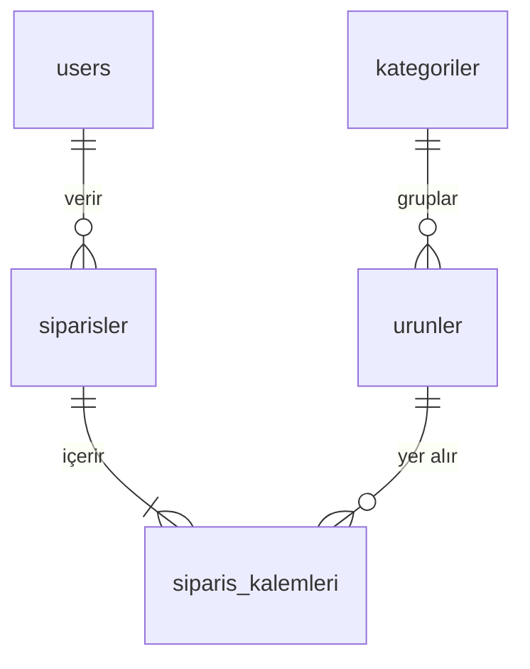

# LocalShop — Geliştirme Planı

## Proje Özeti

**LocalShop**, Türkiye'deki küçük ve yerel işletmelerin (kafe, butik, market, pastane vb.)
komisyon ödemeden kendi dijital vitrinlerini kurmalarını ve sipariş almalarını sağlayan
bir web uygulamasıdır.

Mevcut durum: WhatsApp/telefon üzerinden alınan siparişler takip edilemiyor, stok bilgisi
anlık güncellenemiyor. Büyük e-ticaret platformları yüksek komisyon alıyor ve küçük esnaf
için gereksiz karmaşıklık yaratıyor. LocalShop bu boşluğu doldurmayı hedefliyor.

## Varsayımlar

- İlk sürüm tek işletme odaklı (tek-tenant); çok-tenant v2'ye bırakıldı.
- Ürün görselleri MVP'de URL ile eklenir; dosya yükleme v2'de gelecek.
- Sepet verisi MVP'de `localStorage`'da tutulur; backend'e taşıma v2'de.
- AI özelliği için Google Gemini API `gemini-2.0-flash` modeli kullanılır (ücretsiz tier yeterli).
- Ödeme entegrasyonu MVP kapsamında değil; v2'de iyzico/Stripe planlanıyor.
- Deploy hedefi: Hostinger VPS KVM 2 — Ubuntu 24.04 LTS, Avrupa lokasyonu.

## Kullanıcı Rolleri

| Rol | Açıklama |
|---|---|
| `admin` | İşletme sahibi. Ürün, kategori ve sipariş yönetimi. AI aracına erişim. |
| `musteri` | Son kullanıcı. Vitrin görüntüleme, sepet ve sipariş. |

## Mutlaka Olması Gerekenler

- Kullanıcı kaydı, girişi ve JWT tabanlı rol yönetimi
- Ürün vitrini: listeleme, kategoriye göre filtreleme, ada göre arama, detay sayfası
- Admin ürün yönetimi: ekle / düzenle / sil (soft delete) / stok güncelle
- Sepet: ürün ekle / çıkar / miktar güncelle
- Sipariş: oluşturma (stok kontrolü), durum takibi (bekliyor → teslim)
- Admin sipariş yönetimi: listeleme, detay görüntüleme, durum güncelleme
- **Gemini AI:** ürün adı + fiyat → Türkçe profesyonel açıklama önerisi
- Güvenlik: bcrypt, CORS, JWT expiry, API key backend'de saklama, SQL injection koruması
- Production deploy: Nginx, HTTPS, Systemd

## Teknik Mimari

```
Browser
  │
  ▼
Nginx (80 / 443)
  ├── /          →  React static build (/var/www/localshop/frontend)
  └── /api       →  FastAPI (localhost:8000, Uvicorn)
                        │
                        ├── SQLAlchemy ORM
                        │       └── PostgreSQL (localhost:5432)
                        │
                        └── Gemini API (external, HTTPS)
```

## Teknik Stack

| Katman | Teknoloji | Gerekçe |
|---|---|---|
| Frontend | React 18 + TailwindCSS | Bileşen tabanlı UI, hızlı geliştirme |
| Backend | Python 3.11 + FastAPI | Async, otomatik Swagger, Python bilgisi |
| Veritabanı | PostgreSQL 15 | İlişkisel yapı, transaction desteği |
| ORM | SQLAlchemy 2.x + Alembic | Güvenli sorgu, migration yönetimi |
| Auth | JWT (python-jose) + bcrypt | Stateless, rol bazlı erişim |
| AI | Google Gemini API | Ücretsiz tier, Türkçe içerik üretimi |
| Proxy | Nginx | Reverse proxy, static serve, SSL |
| Süreç | Uvicorn + Systemd | 7/24 çalışma, otomatik yeniden başlatma |
| SSL | Let's Encrypt (Certbot) | Ücretsiz, otomatik yenileme |

## Veri Modeli

```
users               id, email, password_hash, rol, isim, telefon, created_at
kategoriler         id, isim, slug, created_at
urunler             id, isim, aciklama, fiyat, stok, kategori_id, resim_url, aktif, created_at
siparisler          id, user_id, toplam_tutar, durum, adres, not, created_at, updated_at
siparis_kalemleri   id, siparis_id, urun_id, adet, birim_fiyat
```



## API Endpoint Özeti

```
POST   /api/auth/register
POST   /api/auth/login
POST   /api/auth/refresh

GET    /api/urunler                  filtre: kategori, q, sayfa
GET    /api/urunler/:id
POST   /api/urunler                  [admin]
PUT    /api/urunler/:id              [admin]
DELETE /api/urunler/:id              [admin]

GET    /api/kategoriler
POST   /api/kategoriler              [admin]
PUT    /api/kategoriler/:id          [admin]
DELETE /api/kategoriler/:id          [admin]

GET    /api/siparisler               [admin] tümü
GET    /api/siparisler/benim         [musteri] kendisi
GET    /api/siparisler/:id
POST   /api/siparisler               [musteri]
PATCH  /api/siparisler/:id/durum     [admin]

POST   /api/ai/aciklama-olustur      [admin]
```

## Klasör Yapısı

```
localshop/
├── frontend/
│   └── src/
│       ├── components/
│       │   ├── ui/              # Button, Input, Card, Badge
│       │   ├── layout/          # Navbar, Footer, AdminLayout
│       │   └── product/         # ProductCard, ProductList, FilterBar
│       ├── pages/
│       │   ├── public/          # Home, Products, ProductDetail, Cart, Order
│       │   └── admin/           # Dashboard, Products, Orders, Categories
│       ├── hooks/               # useCart, useAuth, useProducts
│       ├── services/            # api.js, authService, productService
│       ├── context/             # AuthContext, CartContext
│       └── utils/               # formatPrice, validators
│
├── backend/
│   ├── app/
│   │   ├── models/              # user, product, order, category
│   │   ├── schemas/             # Pydantic request & response
│   │   ├── routers/             # auth, products, orders, categories, ai
│   │   ├── services/            # auth_service, ai_service
│   │   ├── core/                # config, security, database
│   │   └── main.py
│   ├── alembic/
│   ├── .env.example
│   └── requirements.txt
│
├── MVP.md
├── PRD.md
├── PLAN.md
└── README.md
```

## Geliştirme Fazları

### Faz 1 — Sunucu Kurulumu
- Ubuntu 24.04 paket güncellemesi
- PostgreSQL kurulumu, veritabanı ve kullanıcı oluşturma
- Python 3.11, pip, venv kurulumu
- Node.js 20 kurulumu
- Nginx kurulumu ve varsayılan sayfa doğrulama
- UFW güvenlik duvarı (22, 80, 443 açık)

### Faz 2 — Backend İskeleti
- FastAPI proje yapısı ve sanal ortam
- SQLAlchemy bağlantısı ve `database.py`
- Pydantic `config.py` ve `.env` okuma
- Tüm SQLAlchemy modelleri
- Alembic ilk migration ve uygulama
- `GET /api/healthcheck` — Swagger'da doğrulama

### Faz 3 — Authentication
- `POST /api/auth/register` — bcrypt hash
- `POST /api/auth/login` — JWT access + refresh token
- `POST /api/auth/refresh` — token yenileme
- `get_current_user` ve `require_admin` bağımlılıkları
- Korumalı endpoint testi

### Faz 4 — Tüm API Endpoint'leri
- Kategori CRUD
- Ürün CRUD (soft delete, stok güncelleme, filtre + arama + sayfalama)
- Sipariş oluşturma (stok kontrolü + düşme transaction'ı)
- Sipariş listeleme ve durum güncelleme
- `POST /api/ai/aciklama-olustur` — Gemini entegrasyonu

### Faz 5 — Frontend
- React + TailwindCSS kurulumu, React Router
- AuthContext (token saklama, korumalı route)
- CartContext (localStorage)
- Axios instance (interceptor: token ekleme, 401 refresh)
- Tüm müşteri sayfaları
- Tüm admin sayfaları (AI butonu dahil)

### Faz 6 — Deploy
- `npm run build` → `/var/www/localshop/frontend`
- Nginx konfigürasyonu (/ → React, /api → FastAPI)
- Uvicorn Systemd servis dosyası
- Certbot ile Let's Encrypt SSL
- Production smoke testi

### Faz 7 — Dokümantasyon & Teslim
- `README.md` (kurulum, çalıştırma, mimari, AI açıklaması)
- Yansıtma raporu
- YouTube video demo (8–10 dk)
- GitHub repo düzeni ve `.zip` teslimi

## MVP Sonrası (v2) Yol Haritası

| Özellik | Faz |
|---|---|
| Ürün görseli dosya yükleme (Cloudflare R2) | v2 |
| Ödeme sistemi (iyzico) | v2 |
| E-posta bildirimleri (sipariş onayı) | v2 |
| Çok-tenant mimari | v2 |
| Gelişmiş admin dashboard (Chart.js) | v2 |
| Rate limiting (slowapi) | v2 |
| Unit testler (pytest) | v2 |
| Kargo takip entegrasyonu | v3 |
| Mobil uygulama (React Native) | v3 |

## Başarı Kriterleri

- [ ] Admin giriş yapabilir, ürün ekleyebilir, AI açıklama üreteci çalışır
- [ ] Müşteri kayıt olabilir, ürün listesini görür, arama/filtre kullanabilir
- [ ] Müşteri sepete ürün ekleyip sipariş oluşturabilir
- [ ] Admin siparişi görüp durumunu güncelleyebilir
- [ ] Müşteri sipariş geçmişini görebilir
- [ ] Tüm akış VPS'te HTTPS üzerinden çalışır
- [ ] README kurulum talimatları ile proje sıfırdan ayağa kaldırılabilir
